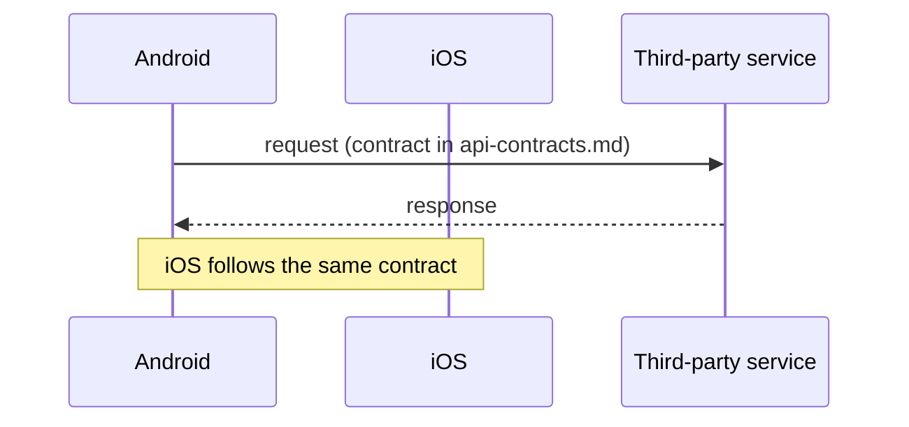

# Architecture Diagrams

The hub holds no product code, so a diagram here shows **flow and impact** at the level a spec or plan would describe it, never class or file structure lifted from source. Follow the repo-wide rules in [`.github/instructions/mermaid.instructions.md`](../../../.github/instructions/mermaid.instructions.md) for syntax and validation.

## When to use

- `/speckit.plan` needs to show how a change moves across Android, iOS, Mockoon and third-party services.
- `/speckit.specify` or `/speckit.clarify` needs a user-step sequence or the states of a screen.
- `/speckit.review` or `/speckit.pull-request` needs to show what actually changed per repo, compared with `plan.md`, inside `pr-evidence.md`.
- A failure, retry or fallback path is clearer as a diagram than as a paragraph.

Do not add a diagram by default. One that restates a short paragraph is clutter; the [lean policy](../../../docs/lean-artifact-policy.md) applies. Embed it in the existing artifact as a fenced `mermaid` block instead of creating a new file.

## Pick the type

| Need | Mermaid type |
|---|---|
| Who calls whom, in order | `sequenceDiagram` |
| Dependencies or impact between repos | `flowchart LR` |
| Screen or request states | `stateDiagram-v2` |
| Decision or fallback path | `flowchart TD` |

## Rules

1. One diagram, one question. Split rather than overload.
2. Participants are real: `Android`, `iOS`, `Mockoon`, and named third-party services from `docs/cross-platform-flows.md` and `docs/api-contracts.md`. Do not invent services, endpoints or components; unknowns go in an Open Question, not into the diagram.
3. Label edges with the action or contract, not code symbols. Mark platform-specific steps (for example `Android only`).
4. Show impact by status: mark each repo as `Required`, `Possible` or `None`, consistent with the impact analysis in the artifact.
5. Keep it small: roughly 12 nodes or fewer, short labels, no colors needed.
6. No secrets, tokens, real user data or internal URLs.
7. Validate the syntax before presenting it.

## Skeleton

Replace the skeleton with the real flow of the feature in hand.
